# Hackathon Submission Entry form

## Team name
The Sitecore Redemption

## Category
Best use of AI

## Description

**AI Content Intelligence** is a Sitecore Marketplace extension that brings real-time, AI-powered content quality analysis directly into the Sitecore Pages editing experience — no context-switching, no separate dashboards.

### Module Purpose

Content editors spend significant time guessing whether their page content is accessible, SEO-optimised, readable, and complete. Traditional CMS platforms offer no in-context feedback loop. This module closes that gap.

### Problem solved

- Editors don't know if their content meets accessibility (WCAG), SEO, or governance standards until after publish
- Organisations struggle to enforce content style, banned phrases, and schema markup requirements at authoring time
- AI-assisted content improvement tools typically live outside the CMS, requiring copy-paste workflows

### How this module solves it

The extension embeds inside Sitecore Pages as a sidebar panel. When an editor opens a page, they click **Analyze** to trigger a two-stage pipeline:

1. **Rules engine** — deterministic checks run instantly against the live field values: title/meta length, word count, passive voice percentage, banned phrases, required Schema.org types, placeholder text detection, and WCAG contrast/alt-text heuristics.

2. **AI semantic analysis** — the page fields are sent to an AI provider (Anthropic Claude or OpenAI GPT) for deeper review: tone alignment, readability grade, completeness, governance, and SEO quality — all guided by per-site configuration stored in Sitecore itself.

Findings are grouped by category (Accessibility, SEO, Readability, Completeness, Governance), colour-coded by severity (Critical / Warning / Suggestion), and include a one-click **Apply Fix** button that writes the AI-suggested replacement value directly back to the Sitecore field without leaving the editor.

All configuration — thresholds, weights, banned phrases, content vibe, vendor API keys — lives in Sitecore content items and is editable via the **Settings** tab inside the extension.

_See full documentation in this file._

## Video link

[Replace this Video link](#video-link)

## Pre-requisites and Dependencies

- **Sitecore XM Cloud** — the extension uses the Sitecore Marketplace SDK and XMC authoring GraphQL API
- **Sitecore Marketplace** — the app is registered as a Marketplace extension point
- **Node.js 20+** and **npm** — to build and run the Next.js application
- **Sitecore CLI 5.x+** — required only for the optional SCS deployment path (`dotnet sitecore ser push`)
- **An AI provider API key** — either:
  - [Anthropic](https://console.anthropic.com/) (Claude Sonnet recommended), or
  - [OpenAI](https://platform.openai.com/) (GPT-4o recommended)

## Installation instructions

There are two independent parts to install: the **Marketplace App** (Next.js) and OPTIONALLY the **Sitecore content items** (templates + configuration).

---

### Part 1 — Deploy the Marketplace App

#### 1.1 — Clone the repository

```bash
git clone https://github.com/<your-org>/2026-The-Sitecore-Redemption.git
cd 2026-The-Sitecore-Redemption/src/sc-redemption-hackaton-mp-app
```

#### 1.2 — Install dependencies

```bash
npm install
```

#### 1.3 — Configure environment variables

Copy the example file and fill in your values:

```bash
cp .env.local.example .env.local
```

Open `.env.local` and set the following (API keys can alternatively be stored in Sitecore — see Part 2):

```env
# Optional: used as fallback if no API key is stored in Sitecore
ANTHROPIC_API_KEY=sk-ant-...
OPENAI_API_KEY=sk-...

# Optional: force a specific provider (anthropic | openai). Auto-detected when omitted.
AI_PROVIDER=anthropic
```

#### 1.4 — Build and start

For local development:

```bash
npm run dev
```

For production:

```bash
npm run build
npm start
```

The app listens on `http://localhost:3000` by default. It must be accessible from the Sitecore Marketplace parent window (use localhost or a tunnel such as ngrok for local development).

#### 1.5 — Register in Sitecore Marketplace

1. In Sitecore Cloud Portal, navigate to **App Studio** → **Create App** 
2. Enter **AI Content Intelligence** for the name and select **custom**
3. Set the extension URL to the deployed app URL (e.g. `https://localhost:3000`)
4. Configure the extension to appear in the **Page Context Panel**
5. for the route, enter **/content-intelligence**
6. An App Icon is provided in the repo under docs
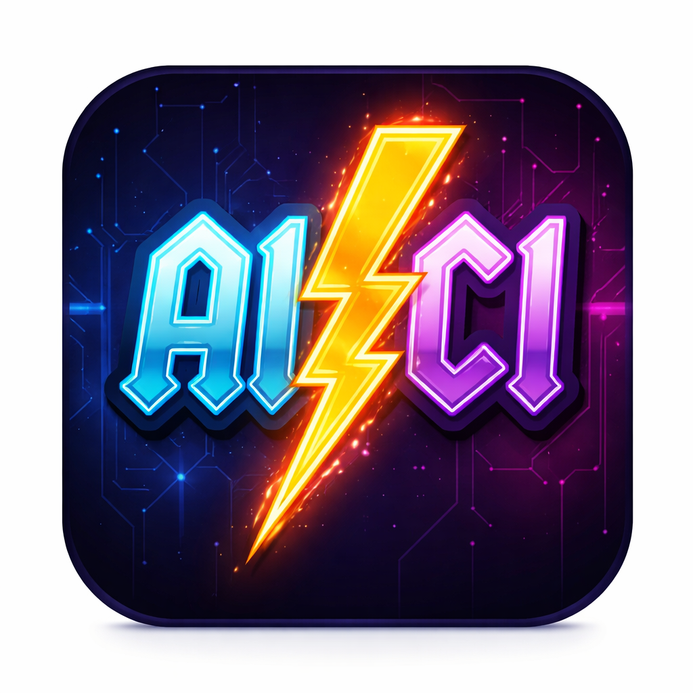
6. Save and activate the marketplace app.
7. Add the application to your environment.


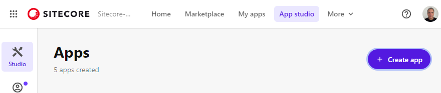

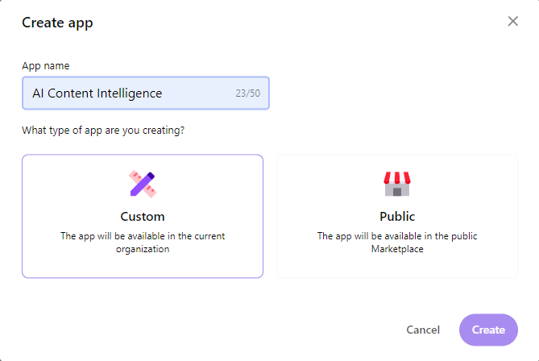

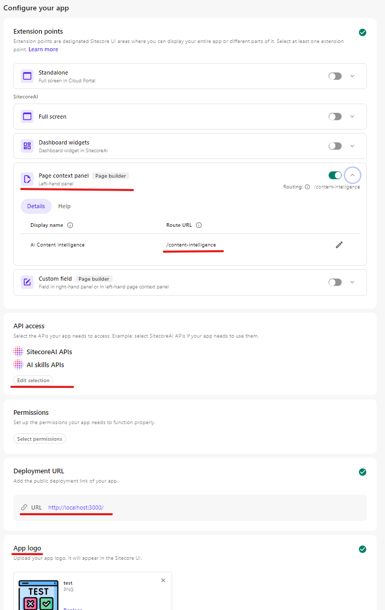

---

### Part 2 — Initialize Sitecore content items

The module requires templates and configuration items under `/sitecore/system/modules/AI Content Intelligence`. There are two ways to create them:

#### Option A — Auto-initialize from the app (recommended for first-time setup)

1. Open a page in Sitecore Pages
2. Click the **AI Content Intelligence** extension in the sidebar
3. If the module has not been set up, a banner will appear — click **Initialize Settings**

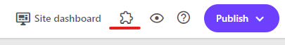

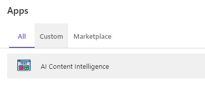

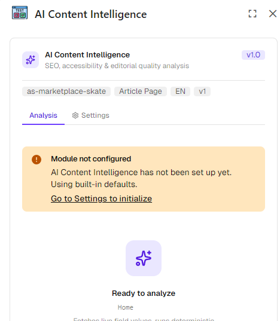

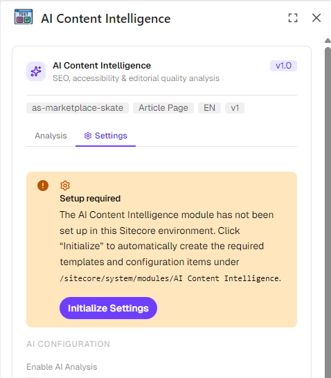

The app will automatically create:
- Custom templates (`AI CI Global Settings`, `AI CI Vendor`, `AI CI Config Option`)
- Module root folder at `/sitecore/system/modules/AI Content Intelligence`
- Global Settings item with sensible defaults
- Vendor items for Anthropic and OpenAI
- Config option items for tone, reading level, and accessibility threshold dropdowns

#### Option B — Sitecore CLI (SCS serialization push)

If you prefer to deploy items through source control:

```bash
# From the repository root (where sitecore.json lives)
dotnet sitecore login
dotnet sitecore ser push --include "AI Content Intelligence"
```

The module definition is at `src/content-intelligence/sitecore/content-intelligence.module.json` and covers:
- `/sitecore/templates/modules/AI Content Intelligence/**`
- `/sitecore/system/modules/AI Content Intelligence/**`

> **Note:** Both approaches are idempotent — running either again will not duplicate items.

---

### Configuration

After initialization, open the **Settings** tab in the extension to complete configuration.

#### Configure your AI vendor

1. Select **Anthropic (Claude)** or **OpenAI (GPT)** from the AI Vendor dropdown
2. Enter your **API Key** and the desired **Model Name** (e.g. `claude-sonnet-4-6` or `gpt-4o`)
3. Click **Save Settings**
4. **JUDGING NOTE:  If you do not have a valid API key to utilize the credits, please reach out to me on slack or email and I can provide them**

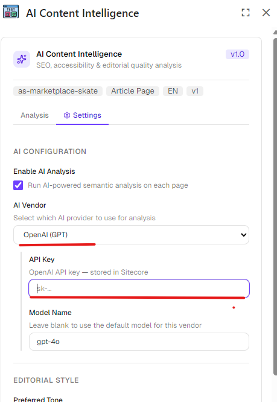

The API key is stored directly in the Sitecore vendor item — it is not stored in the app or any external secret store. Restrict read access to the vendor items in Sitecore's security editor as appropriate for your environment.

---

## Usage instructions

### Opening the extension

Open any page in **Sitecore Pages**. The AI Content Intelligence panel appears in the right-hand sidebar. Switch between the **Analysis** and **Settings** tabs using the tab bar at the top.

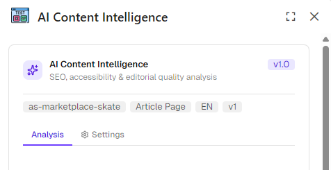

---

### Running an analysis

1. With a page open in Sitecore Pages, click the **Analyze** button in the Analysis tab
2. The extension first fetches all field values from the active page and its datasource items via the Sitecore XMC GraphQL API
3. The **rules engine** runs synchronously, producing instant deterministic findings
4. The **AI analysis** sends the page content to your configured AI provider and returns semantic findings
5. Results appear grouped by category with an overall score and grade

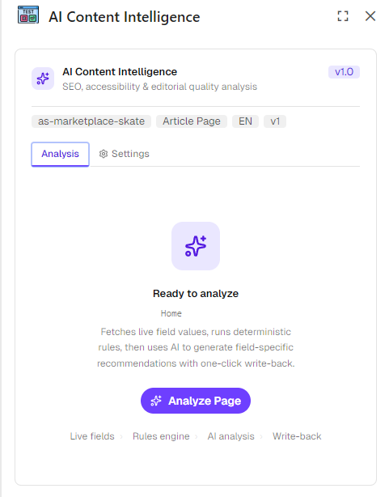

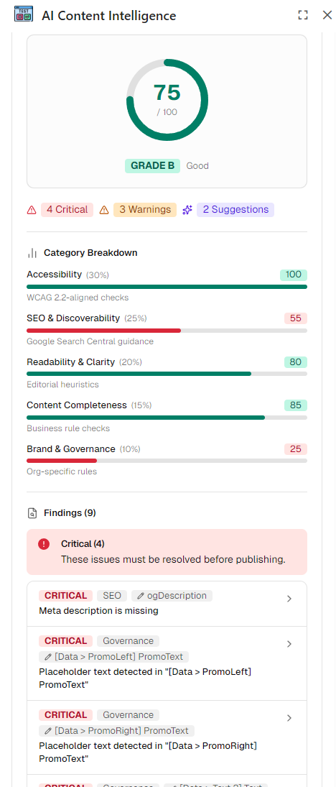

---

### Reading the score

The overall score (0–100) is a weighted average across five categories. The grade bands are:

| Grade | Score |
|-------|-------|
| A | 90–100 |
| B | 75–89 |
| C | 60–74 |
| D | 40–59 |
| F | 0–39 |

Each category bar shows the category score and its configured weight. Category weights are configurable in the Settings tab and must sum to 100.


---

### Reviewing findings

Each finding card shows:

- **Severity badge** — Critical (red), Warning (amber), or Suggestion (blue)
- **Category** — Accessibility, SEO, Readability, Completeness, or Governance
- **Source** — Rules engine or AI
- **Evidence** — the specific field text that triggered the finding
- **Suggested fix** — a plain-language description of what to change
- **Apply Fix button** — available when the AI has produced a ready-to-use replacement value


Findings are sorted by severity (Critical first) within each category.

---

### Applying a fix

When a finding has an **Apply Fix** button:

1. Click the button — the suggested replacement text is shown in a preview
2. Confirm to write the value directly to the Sitecore field via the authoring API
3. The finding card is marked as applied and the button is disabled

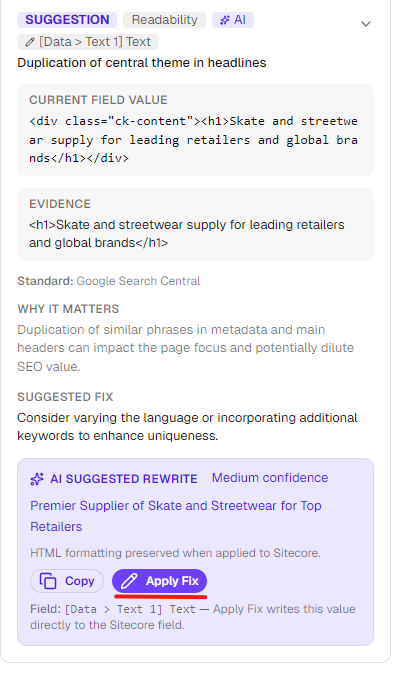

> Re-analyze the page after applying fixes to see an updated score.

---

### Configuring settings

The **Settings** tab exposes all module configuration. Changes take effect on the next analysis run.

#### AI Configuration

| Setting | Description |
|---------|-------------|
| Enable AI Analysis | Toggle AI semantic analysis on/off. Rules-engine checks always run. |
| AI Vendor | Select Anthropic or OpenAI. The vendor item must have a valid API key. |
| API Key | Vendor API key — stored in Sitecore, not in the app. |
| Model Name | Override the default model (e.g. `claude-sonnet-4-6`, `gpt-4o`). |

#### Editorial Style

| Setting | Description |
|---------|-------------|
| Preferred Tone | Formal / Conversational / Technical — guides AI suggestions |
| Reading Level | Elementary / High School / College / Expert — target Flesch-Kincaid grade |
| Content Vibe | Free-text instruction for site personality (e.g. "Catered for a Gen-Z demographic interested in fashion and sustainability") |
| Banned Phrases | One phrase per line — AI flags these as governance findings |
| Required Schema Types | One Schema.org type per line — AI suggests adding missing structured data |

#### SEO Thresholds

| Setting | Default | Description |
|---------|---------|-------------|
| Meta Description Min | 70 | Minimum characters for meta description |
| Meta Description Max | 165 | Maximum characters for meta description |
| Title Min | 10 | Minimum characters for page title |
| Title Max | 70 | Maximum characters for page title |
| Min Body Words | 100 | Minimum word count for body copy |

#### Category Weights

Weights determine each category's contribution to the overall score. They must sum to exactly 100. The Save button is disabled until the sum is correct.

| Category | Default Weight |
|----------|---------------|
| Accessibility | 30 |
| SEO | 25 |
| Readability | 20 |
| Completeness | 15 |
| Governance | 10 |

#### Advanced

| Setting | Description |
|---------|-------------|
| Accessibility Threshold | WCAG 2.2 AA (standard) or AAA (enhanced) |
| Passive Voice Threshold | Maximum % of passive-voice sentences before a readability warning |

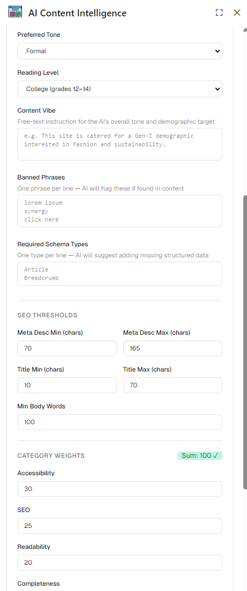

---

### Content items in Sitecore

After initialization the following structure is created and can be inspected or edited in Content Editor:

```
/sitecore/system/modules/AI Content Intelligence/
  Global Settings          ← All configurable thresholds and weights
  Vendors/
    Anthropic              ← VendorName, APIKey, ModelName
    OpenAI                 ← VendorName, APIKey, ModelName
  Config/
    Tones/                 ← formal | conversational | technical
    Reading Levels/        ← elementary | high-school | college | expert
    Accessibility Levels/  ← AA | AAA

/sitecore/templates/modules/AI Content Intelligence/
  AI CI Global Settings    ← Template with all settings fields
  AI CI Vendor             ← Template for vendor items
  AI CI Config Option      ← Template for dropdown option items
```

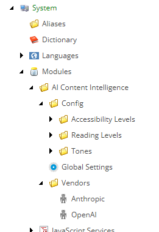

---

## Comments

- The rules engine runs entirely client-side (browser) — no server round-trip needed for deterministic checks, making them instantaneous even on slow connections.
- The AI analysis route (`/api/content-intelligence/analyze`) runs server-side in Next.js. The AI provider API key is passed from Sitecore to the server route in the request body and is **never exposed to the browser**.
- All Sitecore mutations use the XMC authoring GraphQL API (`xmc.authoring.graphql`) rather than the pages API, which means the module works on any content item — not just site pages.
- The module is fully idempotent: initializing twice, or pushing SCS items on top of GQL-bootstrapped items, does not create duplicates.
- Template fields use proper Sitecore field types (Checkbox, Integer, Droplink, Droplist, Multi-Line Text, Single-Line Text) with titles, help text, icons, and `__Standard Values` set — the module looks at home in Content Editor alongside native Sitecore modules.
